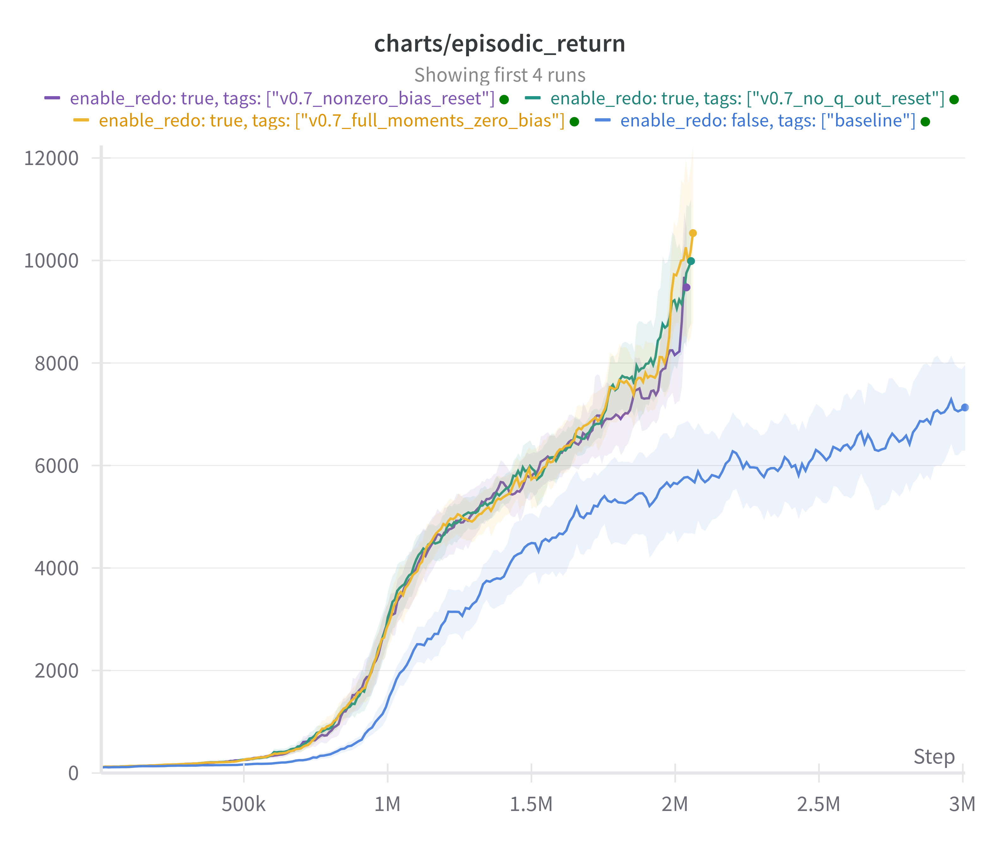
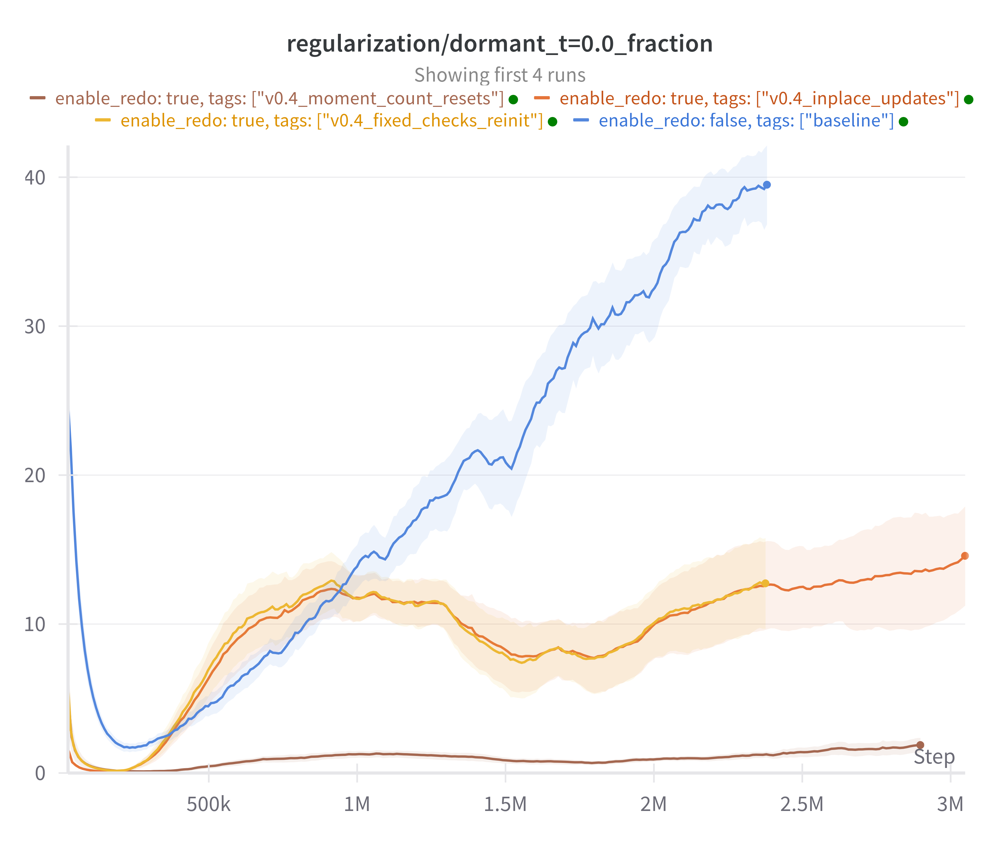

## Recycling dormant neurons

_NOTE: Current status of the code is in progress. I'm pretty sure that most of the `fixed_iteration` branch is correct but some
minor details still need to be checked_.

All of the updates below are based on the `fixed_iteration` branch!

Update 1:  
Fixed and simplified the for-loop in the redo resets.

Udpate 2:
The reset-check in the main function was on the wrong level and the re-initializations are now properly done in-place and work.

Update 3:
Adam moment step-count reset is crucial for performance. Else the Adam updates will immediately create dead neurons again.  
Preliminary results now look promising.

Episodic Return             |  Feature rank
:-------------------------:|:-------------------------:
  |  

### TODOS

- [ ] Check which type of bias reset works better in the ingoing weights
- [ ] Reset outgoing weights momentum
- [ ] Check whether I should reset parts of the Q-function or not.
- [ ] Reproduce paper results and add in the README
