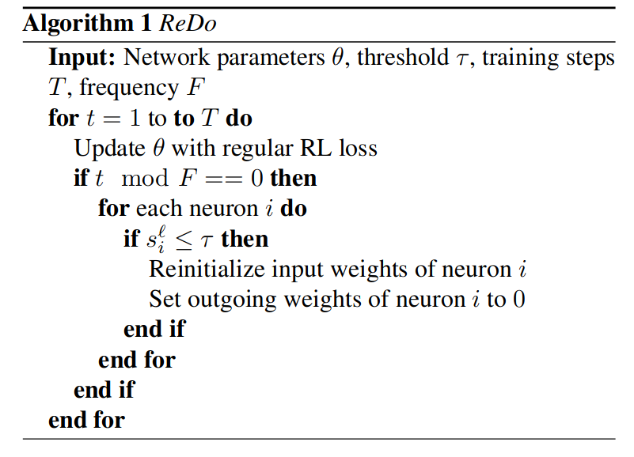
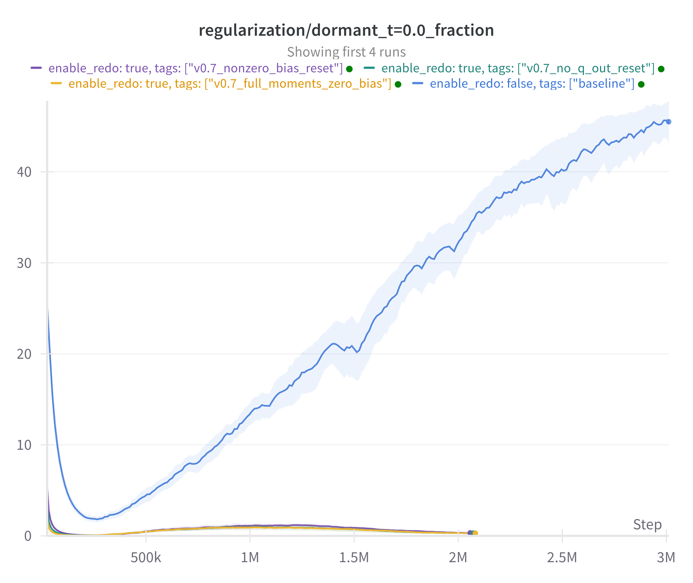

## Recycling dormant neurons

> Status: Code should be correct apart from minor details that I am currently ablating (e.g. whether to reset the bias to 0 or initalization). Final experiments are running and should be done by the end of the week.

Pytorch reimplementation of [ReDo](https://arxiv.org/abs/2302.12902) (The Dormant Neuron Phenomenon in Deep Reinforcement Learning).
The paper establishes the _dormant neuron phenomenon_, where over the course of training a network with nonstationary targets, a significant portion of the neurons in a deep network become _dormant_, i.e. their activations become minimal to compared the other neurons in the layer.
This phenomenon is particularly prevalent in value-based deep reinforcement learning algorithms, such as DQN and its variants. As a solution, the authors propose to periodically check for dormant neurons and reinitialize them.

## Dormant neurons

The score $s_i^{\ell}$ of a neuron $i$ in layer $l$ is defined as the absolute value of its activation $`\mathbb{E}_{x \in D} |h_i^{\ell}(x)|`$ divided by the normalized average of absolute activations within the layer $`\frac{1}{H^{\ell}} \sum_{k \in h} \mathbb{E}_{x \in D}|h_k^{\ell}(x)|`$:

$$`s_i^{\ell}=\frac{\mathbb{E}_{x \in D}|h_i^{\ell}(x)|}{\frac{1}{H^{\ell}} \sum_{k \in h} \mathbb{E}_{x \in D}|h_k^{\ell}(x)|}`$$

A neuron is defined as $\tau$-dormant when $s_i^{\ell} \leq \tau$.

## ReDo



Every $F$-th time step:

1. Check whether a neuron $i$ is $\tau$-dormant.
2. If a neuron $i$ is $\tau$-dormant:  
   **Re-initialize input weights and bias** of $i$.  
   _Set_ the **outgoing weights** of $i$ to $0~.$

## Results

Episodic Return             |  Dormant count
:-------------------------:|:-------------------------:
  |  

## Implementation progress

Update 1:  
Fixed and simplified the for-loop in the redo resets.

Udpate 2:
The reset-check in the main function was on the wrong level and the re-initializations are now properly done in-place and work.

Update 3:
Adam moment step-count reset is crucial for performance. Else the Adam updates will immediately create dead neurons again.  
Preliminary results now look promising.

Update 4:
Fixed the outgoing weight resets where the mask was generated wrongly and not applied to the outgoing weights. See [this issue](https://github.com/timoklein/redo/issues/3). Thanks @SaminYeasar!

## TODOS

- [x] Check which type of bias reset works better in the ingoing weights
- [x] Reset outgoing weights momentum
- [x] Check whether I should reset parts of the Q-function or not.
- [ ] Finish runs and add 10M step experiments
- [x] Update README

## Citations

Paper:

```bibtex
@inproceedings{sokar2023dormant,
  title={The dormant neuron phenomenon in deep reinforcement learning},
  author={Sokar, Ghada and Agarwal, Rishabh and Castro, Pablo Samuel and Evci, Utku},
  booktitle={International Conference on Machine Learning},
  pages={32145--32168},
  year={2023},
  organization={PMLR}
}
```

Training code is based on [cleanRL](https://github.com/vwxyzjn/cleanrl):

```bibtex
@article{huang2022cleanrl,
  author  = {Shengyi Huang and Rousslan Fernand Julien Dossa and Chang Ye and Jeff Braga and Dipam Chakraborty and Kinal Mehta and João G.M. Araújo},
  title   = {CleanRL: High-quality Single-file Implementations of Deep Reinforcement Learning Algorithms},
  journal = {Journal of Machine Learning Research},
  year    = {2022},
  volume  = {23},
  number  = {274},
  pages   = {1--18},
  url     = {http://jmlr.org/papers/v23/21-1342.html}
}
```

Replay buffer and wrappers are from [Stable Baselines 3](https://github.com/DLR-RM/stable-baselines3):

```bibtex
@misc{raffin2019stable,
  title={Stable baselines3},
  author={Raffin, Antonin and Hill, Ashley and Ernestus, Maximilian and Gleave, Adam and Kanervisto, Anssi and Dormann, Noah},
  year={2019}
}
```
